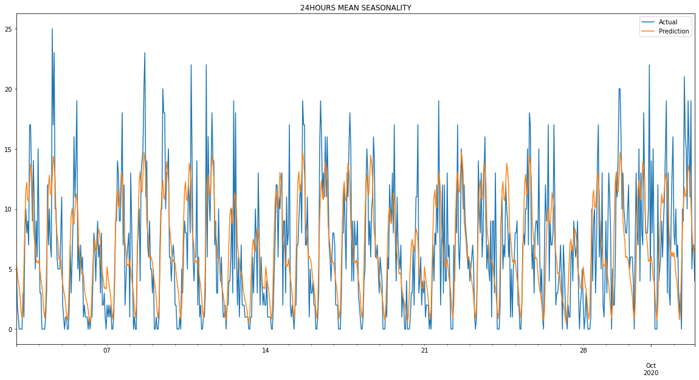

# seasonality-chains
This is a framework dedicated to high-frequency forecasting of any stationary/non-stationary univariate time-series which exhibits at least one type of seasonality. It's able to forecast for years ahead with up to (currently) one hour granularity. 

The main idea behind the framework and its distinction from others (e. g. statsmodels' seasonal_decompose or SARIMAX) is the ability to automatically chain different types of seasonality (daily, weekly, monthly, etc.) into one predictive model which outputs high-frequncy time-series given input of one or several terms of an arbitrary lower frequency. One can freely and flexibly stack them together in one chain as if they are building blocks of a Lego constructor. It's possible to either supply the model with high level manual predictions (e. g. give total value for a next year) or use built-in ARMA/martingale/trend predictions for next periods. 

The framework is a white-box model with simple rationale: real life natural and social processes are often subject not to one, but to many types of seasonality. For example, the number of calls to an emergency service for some particular reason might simultaneously depend on time of the day, day of the week and season (winter, summer) of the year. A chain of seasonality detects and extracts all of these types of seasonality (if any are present) automatically to apply later for a prediction.


## Installation and use
To install the package:

```
pip install seasonality-chains
```

Or you can install from source:

```
git clone https://github.com/andrewargatkiny/seasonality-chains
cd seasonality-chains
pip install .
```

Import the library with:
```python
from schains.tsmodels import UniformModel, SeasonalModel
from schains.chains import ChainedModels, CrossValChain
```

## Performance in real life scenarios
This framework was in part inspired by and used in Boston Consulting Group (BSG) Gamma hackathon to solve a task of forecasting multiple (~1350) time-series of hourly frequency for a full one quarter of the year, thus yielding $90*24=2160$ data points to predict. It outperforms, both in interpretability and goodness of fit, all other ML models that were tried for achieving best predictions, including regression-based models (incl. Lasso, ElasticNet and SARIMA), ANNs, random forests and boosted trees, and also FaceBook Prophet library, specially dedicated to time-series forecasting.

Also, a model which I had built using ONLY this framework became one of the winning (top 5) in Mail.ru Group and Russian Government's ML Championship https://cups.mail.ru/ru/results/leadersofdigital2021?period=past&roundId=616. The task was to predict prices and sales volumes of 39 categories of consumer goods for 3 months ahead on a daily basis for 85 distinct russian regions. 

## Examples
Basic usage examples:

```python
# If your time-series exhibits both weekly and month-of-the-year types
# of seasonality:
models = [SeasonalModel('m', use_input_freq='y'),
    SeasonalModel('d', use_input_freq='w')]
# If it's just month-of-the-year (no weekly oscillations):
models = [SeasonalModel('m', use_input_freq='y'), UniformModel('d')]
# (Each predicted day within a single month will have the same value)

# If it exhibits day-of-the-year seasonality (resulting in 365 seasonal
# indices):
models = [SeasonalModel('d', use_input_freq='y')]

# If value of ts' term depends both on the day of the week and the time
# (season) of the year (for example, 4th Monday of the year always has
# value greater than 11th):
models = [TimeWeekOfYear('d', excl_holidays=True, before_hol=5, after_hol=2)]
# Predefined holidays, 5 days before and 2 days after are modeled just
# by day-of-the-year seasonality, disregarding weekly oscillations.

# If there's no seasonality at all (or you want to model only 
# arma/trend/martingale terms):
models = [UniformModel('d')]
# If you want to predict by a median:
models = [MedianModel('d')]

# Assuming ts is your time-series (pd.Series) with daily frequency
# and its index is a PeriodIndex.
chain = CrossValChain(
    chain_of_models=models, 
    train_ts=ts, # time-series for training seasonal weights of all models
    input_ts=ts.resample('m'), # time-series with frequency >= frequncy of
    # first model in the chain. Used for cross-val and out of sample 
    # predictions.
    step=pd.pd.DateOffset(months=1), # should be equal to input_ts.freq
    train_period=0, # number of past step periods to calculate seasonality
    # for each stage of cross-val or out-of-sample period. When equal to 
    # 0, uses all prior data.
    ar_period=3, # number of past step periods to get next arma/trend/
    # martingale prediction
    trend=True, # use if time-series has a linear trend
    deseason = True, # you can set to false if seasonality is negligible
    # or 'ar_period' is a multiple of lowest frequency used (e.g. 12 
    # months for [SeasonalModel('m', use_input_freq='y'), UniformModel('d')].
    calc_func=SeasonalModel.get_median_weights,
    stype='additive' # 'multiplicative' by default in all models
)
# Cross-validation (assuming ts' index range is at least from 2019-03 and till 
# 2020-12):
chain.predict(pd.Timestamp('2020-01'), pd.Timestamp('2021-01'))
mae = chain.prediction_mae(ground_truth=ts)
print(chain.mae) # or print(chain.metrics)
# Forecast out-of-sample for 9 months ahead:
prediction = chain.predict(pd.Timestamp('2021-01'), pd.Timestamp('2021-10'))
print(prediction) # or print(chain.prediction)
```
More detailed examples of current version's features (basic and advanced) are coming later. As of now, you can learn about them with built-on python `help()` function passing any model or chain name to it as an argument.

Examples of the use of the previous version, experience with the contest along with optimal solution, and its merits and perfomance in a real life problem are described in an article structured as a Jupyter Notebook and availible at [Contest Solution & Real Life Use](https://nbviewer.jupyter.org/github/andrewargatkiny/seasonality-chains/blob/master/Contest%20Solution%20%26%20Real%20Life%20Use.ipynb). 
Give it a read!

# Versions history

## 0.2.0
New features in chains:
* Trend – option to use trend based on simple linear regression
* Deseasoning – option to deseason low-granularity time-series before applying ARMA/trend prediction
* Prediction period – an option to choose a number of steps which models predicts before next step of Walk-Forward cross-validation
* Full training - an option to learn seasonality from all availible training data (even during cross-validation).
* Don't retrain - option to derive seasonality weights of all models in a chain only once for performance reasons. Use with full training.

New features in tsmodels:
* Each time-series now can be classified as one of two datatypes – 'flow' (values can be summed or integrated over time, like volumes or calls/customers per hour) and 'stock', which are basicly point-in-time and are not integrable/divisible (e.g. prices).
* `use_input_freq` parameter. It determines, seasonal weights of which frequency will be used in `predict` method of `SeasonalModel`, overriding frequency of input time-series.
* TimeWeekOfYear model. It simultaneously takes into accont two types of seasonality: a moment during the week and its approximate location within the year timespan. It also considers regular and rolling (e.g. Easter) holidays and dates around them, and predicts them solely by day-of-the-year seasonality.
* MedianModel – predicts input time-series by a median of values supplies during training.

Current limitation: holidays list is hardcoded into TimeWeekOfYear model and it's nesessary to edit source file in order to alter it.

## 0.1.0
The framework uses 2 types of models which represent building blocks for the chains of seasonality:
* UniformModel(output frequency) – takes input time-series and uniformly upsamples it into output frequency;
* SeasonalModel(output frequency) – can be trained on past high-frequency data to estimate and store seasonal weights (indices) for compatible lower frequnces. It takes input time-series, converts to output frequency using UniformModel and, if its original frequency matches one with availible indices, applies them to the series to get final prediction.

Seasonal model is equipped with three functions which can be used to calculate seasonal indices:
* Mean
* Median
* Quantile (percentile) of an arbitrary order q
The functions calculate generalized values of seasonal periods based on their respective statistics and compare them with overal mean of training time-series to produce either additive or multiplicative type indices.
An output of a model can be an input of another model as long as its frequency is lower or equal than second model's output frequency.

The framework has two built-in types of chains:
* base ChainOfModels which offers flexibility in construction and selection of data for training the models and forming predictions on;
* CrossValChain which trains seasonalal models and bases predictions on recent data of user-specified time-windows (train_perdiod and ar_period). It employs simple MA model to predict next high-level values of input, which is conceptually close to ARMA or martingale random processes models, depending on number of considered past lags. Given a past time-series of sufficient length, it can perform a one-step walk-forward time-series validation, hence the name CrossValChain.

In-depth examples of the use of these types of chains are in the Jupyter Notebook file.

This library is a work in progress. Current limitations:
* When in multiplicative mode, works correctly only with nonnegative input time-series.
* ARMA calculation is a simple moving average of ar_period preceeding periods (no prior deseasoning supported). If ar_period=1, it’s a martingale model.
* No trend models, only stationary ARMA/martingale based predictions

